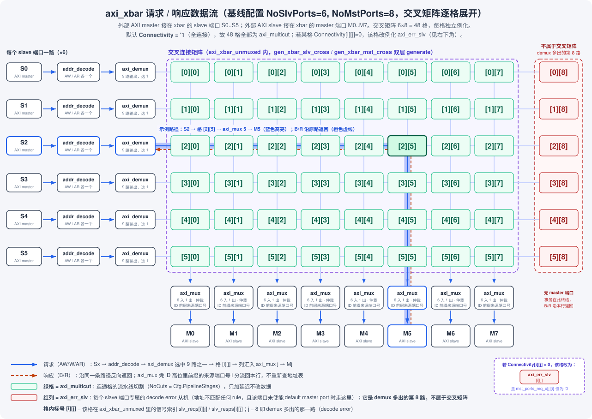

# pulp_axi_xbar_copilot

Agent 驱动的全自动 IC 验证仓库。DUT 为 PULP 官方
[pulp-platform/axi](https://github.com/pulp-platform/axi) 的 `axi_xbar`
（AXI4+ATOP 全连接 crossbar），以只读快照 vendor 于本仓库（v0.39.9，
SHA 锁定见 `vendor/VENDOR.md`）。

工作流采用 [iverif-workflow](https://github.com/AArlert/iverif-workflow)
（copilot profile：orch 主会话纯调度，arch/de/dv/rev 子 agent 产出，
证据链即运行时接口）。本仓库是该工作流的首次实战应用，过程中发现的
框架摩擦记录于 `doc/fw-feedback.md` 并回流框架仓库。

本仓库的验证成果（spec 蒸馏、testplan、UVM 环境、覆盖率收敛过程）供
隔壁人工学习仓库 `pulp_axi_xbar` 参考。

- 上手：`make handover && make next`
- 仿真（VM 内）：`make smoke` / `make run TEST=<t> SEED=<n>` / `make regress`
- 文档约定：表头/机制英文（columns_preset=en），正文中文

## DUT 模块层级

以下为 `axi_xbar`（`vendor/axi/src/axi_xbar.sv`）自顶向下的模块例化关系，
经 grep 各文件的例化语句（含 `generate`/`for` 循环）逐级追出，收敛至
`common_cells`/`tech_cells_generic` 基础单元为止。数量标注分两类：`×NoXxx`
形式取自 `for` 循环的边界参数（随配置变化）；纯数字（如 `×7`）为该模块内
的**实际例化条数**。

```
axi_xbar (vendor/axi/src/axi_xbar.sv)
├─ axi_xbar_unmuxed (vendor/axi/src/axi_xbar_unmuxed.sv)
│  ├─ addr_decode ×NoSlvPorts×2（每个 slave 端口 AW/AR 各一个）(vendor/common_cells/src/addr_decode.sv)
│  │  └─ addr_decode_dync (vendor/common_cells/src/addr_decode_dync.sv)
│  │     └─ 叶子：纯组合逻辑，不再例化子模块
│  ├─ axi_demux ×NoSlvPorts（每个实例 NoMstPorts+1 路输出）(vendor/axi/src/axi_demux.sv)
│  │  ├─ spill_register ×7（AW/W/B/AR/R 各一 + AW/AR 的 select 信号各一）(vendor/common_cells/src/spill_register.sv)
│  │  │  └─ spill_register_flushable (vendor/common_cells/src/spill_register_flushable.sv)
│  │  └─ axi_demux_simple ×1 (vendor/axi/src/axi_demux_simple.sv)
│  │     ├─ axi_demux_id_counters ×2（AW/AR 各一个；仅 `UniqueIds=0` 时例化）(同文件内)
│  │     │  └─ delta_counter ×NoCounters（NoCounters = 2**AxiIdUsedSlvPorts）
│  │     ├─ counter ×1（W 通道 select 的在飞计数，决定 AW 何时可换向）
│  │     └─ rr_arb_tree ×2（B、R 响应从 NoMstPorts+1 路回流时的仲裁）
│  ├─ axi_err_slv ×NoSlvPorts（每个 slave 端口专属的 decode error 从机，接 demux 第 NoMstPorts 路）(vendor/axi/src/axi_err_slv.sv)
│  │  ├─ axi_atop_filter ×1（仅 ATOPs=1 时例化）(vendor/axi/src/axi_atop_filter.sv)
│  │  │  └─ stream_register ×1
│  │  ├─ fifo_v3 ×3（W/B/R 各一）
│  │  └─ counter ×1
│  └─ 交叉连接矩阵：NoSlvPorts×NoMstPorts 格，每格按 Connectivity[i][j] 二选一例化
│     ├─ axi_multicut（Connectivity[i][j]=1，流水线切割）(vendor/axi/src/axi_multicut.sv)
│     │  └─ axi_cut ×NoCuts（NoCuts = Cfg.PipelineStages）(vendor/axi/src/axi_cut.sv)
│     │     └─ spill_register ×5（AW/W/B/AR/R 各一）
│     └─ axi_err_slv（Connectivity[i][j]=0；同时 mst_ports_req_o[j][i] 恒接 '0）(vendor/axi/src/axi_err_slv.sv)
│        └─ 子树同上（axi_atop_filter + fifo_v3 ×3 + counter ×1）
└─ axi_mux ×NoMstPorts (vendor/axi/src/axi_mux.sv)
   ├─ 分支一 gen_no_mux：NoSlvPorts==1（整个 xbar 只有一个 slave 端口时的旁路，
   │  │                  无仲裁、无 ID 前缀，因为主端口 ID 位宽与从端口相同）
   │  └─ spill_register ×5（AW/W/B/AR/R 各一）
   └─ 分支二：NoSlvPorts>1（正常仲裁路径，与分支一二选一）
      ├─ axi_id_prepend ×NoSlvPorts (vendor/axi/src/axi_id_prepend.sv)
      │  └─ 叶子：纯组合逻辑，不再例化子模块
      ├─ rr_arb_tree ×2（AW、AR 请求侧各一个轮询仲裁器）
      ├─ fifo_v3 ×1（记录 AW 的胜者，W beats 据此跟随）
      └─ spill_register ×5（AW/W/B/AR/R 各一）
```

## 数据流概览

`axi_xbar` 对外是 `NoSlvPorts`（基线 6）个 slave 端口进、`NoMstPorts`（基线 8）个
master 端口出的交叉开关。注意端口命名是**站在 xbar 自己的角度**说的：外部 AXI
master 接在 xbar 的 slave 端口（S0..S5）上发起请求，外部 AXI slave 接在 xbar 的
master 端口（M0..M7）上接收请求。一笔事务从某个 slave 端口进来，查地址表决定该
走哪个 master 端口，穿过交叉矩阵后送出，响应原路返回。

下图按基线 6×8 画出，交叉矩阵 48 格逐格展开；蓝色高亮为一条示例路径
（S2 的事务命中 M5），橙色虚线为它的响应回程：



### 请求路径

1. **`addr_decode` 查地址表**：每个 slave 端口的 AW/AR 各有一个独立的
   `addr_decode`（共 `NoSlvPorts×2` 个），拿地址去 `addr_map_i` 里比对，得到目标
   master 端口编号。命中不了任何 rule 时分两种情况（spec §3.3 / §4）：该端口使能
   了 default master port（`en_default_mst_port_i[i]`）就路由到
   `default_mst_port_i[i]` 指的那个 master 端口；否则判为 decode error。
2. **`axi_demux` 按端口分流**：每个 slave 端口一个，输出有 `NoMstPorts+1` 路——
   前 `NoMstPorts` 路对应矩阵里本行的各个格子，多出来的第 `NoMstPorts` 路专门接
   本端口自己的 decode error 从机。同一拍只选中其中一路。内部还管理"同 ID 事务未
   应答完前不能改投别的出口"（`axi_demux_id_counters`，仅 `UniqueIds=0` 时才例
   化；`UniqueIds=1` 时这套计数器被省掉），并插几级 `spill_register` 改善时序。
3. **交叉连接矩阵**：`NoSlvPorts × NoMstPorts` 个格子逐格例化，格 `[i][j]` 是
   slave 端口 `i` 与 master 端口 `j` 之间那条唯一路径。`Connectivity[i][j]=1`
   （默认 `'1`，即基线 48 格全连通）时该格例化 `axi_multicut`，按
   `Cfg.PipelineStages` 插几级流水线切割，只加延迟不改数据；`Connectivity[i][j]=0`
   时该格改例化 `axi_err_slv`，并把 `mst_ports_req_o[j][i]` 恒接 `'0`。**注意**该
   格的应答行为在许可来源中未定义（spec §8.2），验证侧按 spec §8.3 的环境约束构造
   地址表，使"地址译码到非连通 master 端口"根本不可发生——M3/M4 的稀疏
   `Connectivity` 只在"地址表与连通矩阵一致"的合法子集上测，不去踩这一格。
4. **`axi_mux` 出口合流**：矩阵的第 `j` 列（`NoSlvPorts` 个格子的输出）汇进第
   `j` 个 `axi_mux`——即格 `[i][j]` 接到 `axi_mux j` 的第 `i` 路输入。`axi_mux`
   负责：① 用轮询仲裁器（`rr_arb_tree`，AW/AR 各一个）决定这一拍放谁走；② 把
   "这笔事务从哪个 slave 端口来"作为高位前缀拼进事务 ID（`axi_id_prepend`，
   主端口 ID 因此比从端口宽 `$clog2(NoSlvPorts)` 位）——响应要靠这个前缀才能找
   到回家的路；③ 合并成一条 AXI 接口，驱动外部下游 slave。

### 响应路径

B/R 响应从 master 端口回来，`axi_mux` 取 ID 高位里的来源端口号，就知道该分流回本
列的哪一格，一路沿原路走回对应 slave 端口的 `axi_demux`（demux 侧同样用
`rr_arb_tree` 在 `NoMstPorts+1` 路回程中仲裁），最后从原来进来的那个 slave 端口把
B/R 吐给外部 master——全程原路返回，不重新查地址表。走 decode error 从机的事务同
理：事务终结在那里，响应沿本行返回。

### `axi_err_slv` 与 ATOP

`axi_err_slv` 在两个位置出现，例化数量和触发条件都不同：

- **decode error 从机**：每个 slave 端口一个（共 `NoSlvPorts` 个），接 demux 的第
  `NoMstPorts` 路，触发条件是"地址不匹配任何 rule 且该端口未使能 default master
  port"。
- **未连通格的从机**：仅在 `Connectivity[i][j]=0` 的那些格子上例化，个数取决于连
  通矩阵有多稀疏（基线全连通时一个都没有）。

两者都是"吞下整个事务并回错误响应"的同一类部件（只有 `MaxTrans` 参数不同），但
**期望的响应码以 `doc/spec.md` 为准**：spec §4 规定 decode error 路径回
`RESP_DECERR`、beat 数正确（读出齐 `AxLEN+1` 拍、末拍 `RLAST=1`，写在收齐 W burst
后回单拍 B），读数据为 `32'hBADCAB1E` 零扩展/截断；而未连通格的应答行为许可来源
未定义（spec §8.2），不写 checker。

若被判错的事务恰好是 ATOP（`aw.atop != '0` 的原子操作），原子读要求 B 和 R 两个
通道都返回响应（spec §6.3），错误从机内部因此带一个 `axi_atop_filter` 来生成这对
双响应。这属实现细节，行为规格角度只需要知道"ATOPs=1 时错误从机也能正确生成双响
应"，DV 记分板按 spec §4 / §6 覆盖到即可。

### 设计动机

- **先分后合**：slave 端口各自独立分流（`demux`），master 端口各自独立合流
  （`mux`），中间用交叉矩阵解耦，因此 `NoSlvPorts`/`NoMstPorts` 可独立配置、连
  接关系（`Connectivity`）也可稀疏。
- **ID 前缀是找路的钥匙**：进去时不记路，回来时全靠 ID 高位前缀的"来源端口号"
  找到回家的路，这也是 spec §5（ID 与保序）重要的原因，直接决定 scoreboard 该怎
  么判断响应有没有走错端口。
- **错误也要有个终点**：AXI 不允许请求悬空不应答，所以"地址查不到"和"这条路没
  修"两种情况都得有一个部件把事务吞掉并回一个合法的错误响应，这就是
  `axi_err_slv` 存在的理由。
