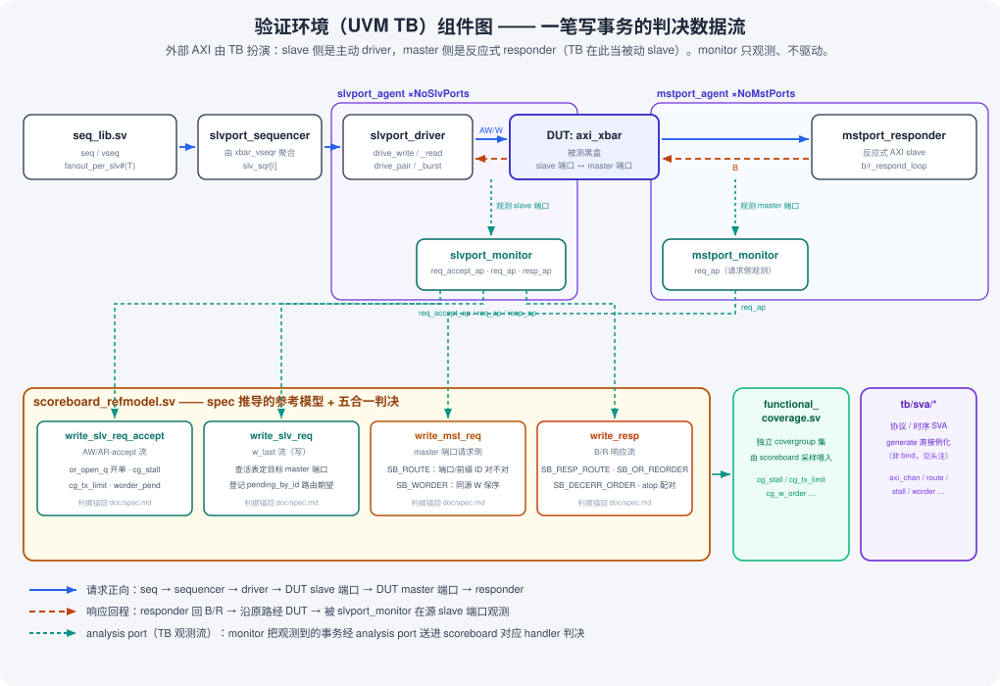

# 验证环境：从零读懂本项目的 UVM TB

> **这份文档是什么**：给人看的验证环境（UVM testbench）入门读物，逐层递进，
> 落到本仓库怎么搭 TB、一笔事务怎么被验证、去哪个文件找什么。目标读者是
> **没读过这个仓库、但懂一点 UVM 基础**的新人。
>
> **它和 `doc/axi.md` 的分工**：`axi.md` 讲**被测对象**（AXI 协议本身 + DUT
> `axi_xbar`）；本文讲**验证它的环境**（UVM TB）。两者互补——先懂 DUT 再看
> 怎么验它，或反过来都行。
>
> **它不是什么**：**不是规格，不得作为 checker 期望值的来源。** 期望值只有
> 一个来源——`doc/spec.md`（CLAUDE.md 红线 2）。本文凡涉及判据处一律给
> spec 章节号，以 spec 为准。
>
> **每节末尾/文中有 `📎 对照代码`**，给出 `tb/` 里的确切文件与行号（行号对应
> 当前代码状态，重构后会漂移；以文件为准）。

---

## 目录

- [§0 UVM 分层速览（通用概念，不是本仓库特有）](#0-uvm-分层速览通用概念不是本仓库特有)
- [§1 本仓库的组件地图](#1-本仓库的组件地图)
- [§2 跟着代码走一遍：一笔写事务](#2-跟着代码走一遍一笔写事务)
- [§3 为什么既有 SVA 又有 scoreboard](#3-为什么既有-sva-又有-scoreboard)
- [§4 常见误解 / 新人陷阱](#4-常见误解--新人陷阱)
- [§5 术语表](#5-术语表)
- [§6 延伸阅读](#6-延伸阅读)

---

## §0 UVM 分层速览（通用概念，不是本仓库特有）

先把 UVM 的几个角色钉死。**这一节讲的是任何 UVM 环境都有的通用概念**，和本
仓库无关；懂 UVM 的读者可以直接跳 §1。

- **sequence（序列）**：描述"要发什么事务"的脚本。它不碰引脚，只产生一个个
  **sequence item**（事务对象），交给 sequencer。
- **sequencer（序列器）**：sequence 与 driver 之间的仲裁通道。sequence 通过它
  把 item 递给 driver。
- **driver（驱动器）**：唯一碰引脚、**主动驱动**的组件。把抽象的 item 翻译成
  一拍一拍的引脚电平（AW/W 握手等）。
- **monitor（监视器）**：**只观测、不驱动**。在接口上采样已经发生的事务，打包
  成观测对象，通过 **analysis port** 广播出去。它是被动的——TB 里"发生了什么"
  的唯一事实来源。
- **agent（代理）**：把某一个接口上的 driver + monitor +（可选）sequencer 打包
  成一个可复用单元。一个"主动 agent"含 driver；一个"被动 agent"可能只有
  monitor，或用一个 responder 代替 driver。
- **scoreboard（记分板）**：判决中心。订阅各 monitor 的 analysis port，用一个
  **参考模型**算出"应该是什么"，和 monitor 观测到的"实际是什么"比对。
- **env（环境）**：把上面这些组件例化、连线、配置成一个完整可跑的验证环境。

关键心智模型：**driver/responder 在引脚上"制造"事务，monitor 在引脚上"观测"
事务，scoreboard 只吃 monitor 的观测流做判决——判决永远基于观测到的事实，
不基于 driver 的意图。**

---

## §1 本仓库的组件地图

本仓库的 TB 是一个 `axi_xbar` 单 DUT 环境：N 个外部 AXI master 接在 DUT 的
slave 端口上，M 个外部 AXI slave 接在 DUT 的 master 端口上（基线 6 主 × 8 从，
命名视角见 `doc/axi.md` §0）。自顶向下：

```
tb_top (tb/tb_top.sv)                     ── 单 axi_xbar DUT + N 主 M 从接口 + SVA 例化
└─ xbar_env (tb/xbar_env.sv)              ── 把所有组件例化并连线
   ├─ slvport_agent ×NoSlvPorts (tb/slvport_agent.sv)   ── 主动侧（TB 当 master）
   │   ├─ slvport_driver      ── 主动驱动 AW/W/AR 到 DUT slave 端口
   │   ├─ slvport_monitor     ── 观测 DUT slave 端口，3 条 analysis port
   │   └─ slvport_sequencer   ── 由 xbar_vseqr 聚合成 slv_sqr[i]
   ├─ mstport_agent ×NoMstPorts (tb/mstport_agent.sv)   ── 被动侧（TB 当 slave）
   │   ├─ mstport_responder   ── 反应式 AXI slave：收 AW/AR，回 B/R
   │   └─ mstport_monitor     ── 观测 DUT master 端口，1 条 analysis port
   ├─ scoreboard_refmodel (tb/scoreboard_refmodel.sv)   ── 参考模型 + 五合一判决
   └─ functional_coverage (tb/functional_coverage.sv)   ── 独立 covergroup 集
   ── 另有 tb/sva/* 协议/时序 SVA，由 tb_top 的 generate 循环直接例化（非 bind）
```

**序列与虚序列**都在 `tb/seq_lib.sv`：per-slave-port 的子序列（如
`slvport_basic_seq`）+ 把它们按每 slave 端口扇出的虚序列（如
`m1_01_smoke_vseq`）。扇出骨架被压进一个参数化 helper `fanout_per_slv#(T)`。

下图画出这些组件之间的连接关系与**一笔写事务在 TB 侧的数据流**（不是 DUT
内部路径——那是 `axi_xbar_dataflow.svg`）：seq 产生 item → driver 打到 DUT
slave 端口 → 两个 monitor 在 DUT 两侧观测 → analysis port 送进 scoreboard 的
四个 handler → 与 DUT 响应比对判决。



- 蓝实线 = 请求正向（seq→driver→DUT→responder）
- 橙虚线 = 响应回程（responder 回 B/R，沿原路经 DUT，被源端口 monitor 观测）
- 青虚线 = analysis port（monitor 的观测流送进 scoreboard 对应 handler）

### 📎 对照代码：组件与连线

| 组件 | 文件:行 |
|------|---------|
| `tb_top` 例化 `axi_xbar` | `tb/tb_top.sv:116` |
| `xbar_env` | `tb/xbar_env.sv:14` |
| `xbar_vseqr`（虚序列器，持 `slv_sqr[i]`） | `tb/xbar_env.sv:4` |
| `slvport_driver` / `slvport_monitor` | `tb/slvport_agent.sv:22` / `:300` |
| `slvport_agent` | `tb/slvport_agent.sv:575` |
| `mstport_responder` / `mstport_monitor` | `tb/mstport_agent.sv:25` / `:176` |
| `mstport_agent` | `tb/mstport_agent.sv:280` |
| `xbar_scoreboard` | `tb/scoreboard_refmodel.sv:31` |
| `xbar_functional_coverage` | `tb/functional_coverage.sv` |
| 序列 / 虚序列 / 扇出 helper | `tb/seq_lib.sv`（`fanout_per_slv` `:96`） |

analysis port 到 scoreboard handler 的连线全在 `connect_phase`
（`tb/xbar_env.sv:38`）：

```systemverilog
// tb/xbar_env.sv:41,45,46,50
slv_agent[i].monitor.req_ap.connect(sb.slv_req_imp);          // → write_slv_req
slv_agent[i].monitor.req_accept_ap.connect(sb.slv_req_accept_imp); // → write_slv_req_accept
slv_agent[i].monitor.resp_ap.connect(sb.resp_imp);            // → write_resp
mst_agent[j].monitor.req_ap.connect(sb.mst_req_imp);          // → write_mst_req
```

---

## §2 跟着代码走一遍：一笔写事务

拿 M1-01 smoke 的一笔简单写 burst，跟它从 seq 产生一路走到 scoreboard 判完。
**这一节是 `tb/scoreboard_refmodel.sv:27` 那段事务流转注释的展开版**——注释求
简洁，这里可以啰嗦。

**第 1 站 · seq 造 item。** `slvport_basic_seq`（`tb/seq_lib.sv:40`）造一个
`axi_seq_item`，`is_write=1`，地址落在某个 rule 命中区（走 happy path），
payload 用共享 helper `fill_wr_payload`（`tb/seq_lib.sv:31`）逐 beat 填
`{$urandom(),$urandom()}` + `wstrb='1`。item 经 sequencer 递给 driver。

**第 2 站 · driver 打引脚。** `slvport_driver.drive_write`
（`tb/slvport_agent.sv:70`）把 item 翻成 AW 握手 + W burst，驱动到 DUT 的
slave 端口。driver 是单 outstanding 的（一次一笔到完成），这是很多场景"结构上
不会触发 §5.2 假冲突"的根因。

**第 3 站 · monitor 观测（一笔事务，两条独立流）。** `slvport_monitor`
（`tb/slvport_agent.sv:300`）在 DUT slave 端口上观测，**把一笔写事务拆成两条
analysis port**（这是 BUG-0018 引入的拆分，见 §4）：

- **AW 握手被接受的那一拍** → `req_accept_ap`（`:315`）→ scoreboard
  `write_slv_req_accept`（`tb/scoreboard_refmodel.sv:587`）。这一路只做**锚在
  AW-accept 时刻**的记账：§5.2 stall 开单（`or_open_q`）、`cg_tx_limit` 在飞
  采样、写方向的 `worder_pend` 登记。
- **W burst 最后一拍（w_last）** → `req_ap`（`:305`）→ scoreboard
  `write_slv_req`（`tb/scoreboard_refmodel.sv:421`）。这一路做**路由期望登记**：
  按事务自己 AW-accept 时刻的**活表版本**（spec §3.4，支持运行时重配）解码出
  目标 master 端口，把这笔请求按**期望的 master 侧前缀 ID**（spec §5.1.1）压进
  `pending_by_id`。若地址未命中且没使能 default 端口 → 走 err_slv，只登记响应侧
  期望（spec §4）。

**第 4 站 · master 端口侧观测 + 路由判决。** DUT 把请求路由到目标 master 端口，
`mstport_monitor`（`tb/mstport_agent.sv:176`）在那里观测，`req_ap`（`:181`）→
scoreboard `write_mst_req`（`tb/scoreboard_refmodel.sv:702`）。这里 pop
`pending_by_id`，做 **SB_ROUTE** 判决（`:722`）：请求是否路由到了正确的 master
端口、带着正确的前缀 ID？查不到匹配记录就是**走错端口 / 前缀公式被违反**。同时
做 **SB_WORDER**（`:808`）：每个源端口自己的 W burst 是否按该源的 AW 顺序完成
（spec §5.5.1）。

**第 5 站 · responder 回程 + 响应判决。** `mstport_responder`
（`tb/mstport_agent.sv:25`）作为反应式 slave 回 B（`b_respond_loop` `:138`）。
B 沿原路经 DUT 回到源 slave 端口，被 `slvport_monitor` 观测，`resp_ap`（`:316`）
→ scoreboard `write_resp`（`tb/scoreboard_refmodel.sv:841`）。这是**五合一响应
判决**：

- **SB_RESP_ROUTE**（`:864`）：B/R 回到了真正的源 slave 端口？（前缀高位路由，
  spec §5.1.2/§5.1.3）
- **SB_OR_REORDER**（`:975`）：同 bucket 完成序未被乱序（spec §5.2.3）
- **SB_DECERR_ORDER**（`:892`）：同完整 ID 的 OKAY/DECERR 按接受序完成
  （spec §5.2.6-2.a）
- **decerr 响应码 / beat 数 / 读数据**（`SB_DECERR_RDATA` `:1020`，`ERR_RDATA`
  常量从 pinned spec §4.4 推导，`:174`）
- **atop B+R 配对**（spec §6.3）

命中场景的读数据用参考模型 `predict_beat_data`（`tb/scoreboard_refmodel.sv:1053`
调用）算期望值，写方向判 RESP_OKAY。

一句话概括这一趟：**item → 引脚 → 两条观测流（AW-accept / w_last）→ master
侧路由判决 → 回程响应五合一判决**，每一步的期望值都锚回 `doc/spec.md`。

---

## §3 为什么既有 SVA 又有 scoreboard

两条判决路径并存，分工不同：

- **SVA（`tb/sva/*`）判"逐拍的协议 / 时序契约"。** 挂在**端口接口**上，看每一个
  时钟沿：握手稳定性、无 X、§5.2 stall 的相位窗口、§5.4 事务数上限（txlimit
  天花板）、§5.5 W 保序的同沿并发等——这些是"某个信号在某个周期该/不该怎样"的
  契约，天然用断言表达，且可逐拍证伪。
- **scoreboard（`tb/scoreboard_refmodel.sv`）判"端到端的功能正确性"。** 需要
  **跨事务的状态**和**参考模型计算**才能判的东西：地址路由、数据完整性、ID 前缀
  找路、响应码、跨事务的完成序。这些没法用一条逐拍断言表达，得攒一张
  `pending_by_id` / `or_open_q` 之类的记账表。

选谁判某条判据，锚点写在 testplan 各行与 `doc/design-prompt/sva_bind.md`。粗线：
**"这一拍引脚合不合法" → SVA；"整笔事务/一串事务结果对不对" → scoreboard。**

**一个本仓库特有的机制细节**：这些 SVA **不是用 `bind` 挂上去的**，而是在
`tb_top` 的 generate 循环里**直接例化**（`tb/sva_bind.sv:19` / `:25`，由
`tb/tb_top.sv:148` include）。原因是 VCS-2018.09-SP2 拒绝
`bind <interface> <module>`（`Error-[IIM]`，见 `scripts/make/vcs-2018.mk` 头部
与 `tb/sva_bind.sv:11-18` 的注释）。因为 `tb_top.sv` 是 DV 自己拥有的（不像
DUT），`bind` 的"非侵入挂载"好处在这里并不适用，直接例化反而让 checker 模块
保持独立可复用。

### 📎 对照代码：SVA 文件清单

`tb/sva/` 下：`axi_chan_sva.sv`（逐通道 AXI 协议）、`axi_xbar_route_sva.sv`
（路由）、`axi_xbar_stall_sva.sv`（§5.2 stall）、`axi_xbar_worder_sva.sv`
（§5.5 W 保序）、`axi_xbar_txlimit_sva.sv`（§5.4 事务数上限）、
`axi_xbar_atop_sva.sv`（§6 ATOP）。

---

## §4 常见误解 / 新人陷阱

这几个点新人最容易看错，正确理解列在后面：

1. **两类 agent 的"动作组件"命名不对称。** slave 端口侧是 `slvport_driver`
   （主动驱动），master 端口侧却是 `mstport_responder`（被动响应），而且
   `mstport_agent` 里**没有 sequencer**。新人常先入为主去找 `mstport_driver`
   而找不到。**正解**：这是合理的不对称——外部 AXI master 由 TB 主动扮演（slave
   端口侧要发起事务，所以是 driver），外部 AXI slave 由 TB 被动扮演（master
   端口侧只需要对 DUT 发来的请求回响应，所以是 responder，无需 sequence 驱动）。
   记住"TB 在 master 端口侧扮演被动 slave"就不会去找 driver 了。

2. **一笔事务的判决被 BUG-0018 拆成两条并行流。** 新人看到同一笔写事务在
   scoreboard 里被 `write_slv_req_accept` 和 `write_slv_req` 两个 handler 分别
   处理，容易以为是两笔事务或重复处理。**正解**：这是 BUG-0018 的正当拆分——写
   事务的 AW 握手（accept 时刻）比 W burst 结束（w_last 时刻）早好几拍，覆盖
   采样（§5.2 stall / tx_limit / worder）必须**锚在 AW-accept**才准，否则会因为
   迟到的 w_last 而漏采/错采。所以 monitor 发两条流：`req_accept_ap` 走
   accept-时刻的记账，`req_ap` 走 w_last-时刻的路由登记（读方向两者重合，因为
   AR-accept 就是 accept）。见 §2 第 3 站与 `tb/scoreboard_refmodel.sv:27` 的
   流转图。

3. **`m_probe` 静态句柄是隐蔽的耦合。** `functional_coverage.sv:66` 有一个
   `static xbar_functional_coverage m_probe`，在 scoreboard 建好 fcov 时被赋值
   （`:368`），SVA（`tb/sva/axi_xbar_stall_sva.sv`）通过这个**全局静态句柄**采样
   覆盖（`:413` 附近）。**正解**：这是一条"SVA 侧仪表 → 覆盖库"的桥，依赖
   **恰好只有一个 scoreboard/fcov 被 build**（多实例会互相覆盖句柄）。新人读
   SVA 时若发现它引用了一个"不知道哪来的"覆盖对象，答案就在这里——它不是通过
   端口连线拿到的，而是抓的全局静态句柄。当前记为"已知脆弱耦合"，不是 bug。

---

## §5 术语表

**UVM 通用**

- **sequence item / 事务对象**：一笔抽象事务（本仓库是 `axi_seq_item` 及其
  派生 `axi_pair_item` / `axi_burst_item`）。
- **analysis port**：monitor 广播观测结果的单向端口；scoreboard/coverage 订阅它。
- **参考模型（reference model）**：scoreboard 内部"算出应该是什么"的那部分逻辑，
  本仓库全部锚回 `doc/spec.md`。

**本仓库特有缩写 / 记账术语**（scoreboard 里）

- **or_open（`or_open_q`）**：per-(源端口, ID bucket, 方向) 的"开单"表，记同
  bucket 同方向还没完成的请求，是 §5.2 stall/保序判决的账本。
- **worder（`worder_pend` / SB_WORDER）**：per-(源端口, 目标 master 端口) 的 W
  完成序期望，判"同一源的 W burst 按其 AW 接受序完成"（spec §5.5.1）。
- **pending_by_id**：按**期望 master 侧前缀 ID** 索引的在飞请求表，路由判决
  （SB_ROUTE）从这里 pop。
- **atop_key / atop 配对**：原子操作（`aw.atop != '0`）owes B+R 两个响应
  （spec §6.3），用这个 key 配对判是否两条都回了。
- **err_order_q / ERR_RDATA**：decode-error 路径的记账——是否期望 DECERR、错误
  读数据常量（从 pinned spec §4.4 推导，不引 RTL）。
- **fanout_per_slv#(T)**：`seq_lib.sv` 里"每 slave 端口扇出一条子序列"的参数化
  helper（`tb/seq_lib.sv:96`）。
- **fill_wr_payload**：填写 burst 写 payload 的共享 helper（`tb/seq_lib.sv:31`）。

---

## §6 延伸阅读

- `doc/axi.md` —— 讲**被测对象**（AXI 协议 + DUT `axi_xbar`）；本文讲**验证它
  的环境**，两者互补。
- `doc/spec.md` —— **判据的唯一来源**。本文所有 spec 章节号都指向它；
  checker 期望值只准从这里推导。
- `doc/testplan.md` —— 场景真值表：每个场景的判据锚点、状态、重放命令。
- `doc/bugs.md` —— 缺陷总表与五类分诊速查（本文提到的 BUG-0018 拆分等历史
  缺陷记录见 `git show v0.5.3-pre-reset:doc/bugs.md` 及其归档）。
- 前任团队的详细设计说明（TB 结构约束、SVA 挂载机制、判决红线的推导过程）
  已随 0.5.4 重置移出工作树，查阅用
  `git show v0.5.3-pre-reset:doc/design-prompt/<file>.md`
  （`sva_bind.md` / `uvm_env.md` / `scoreboard_refmodel.md` 等）。其中仍然
  有效的判决红线两条已并入 spec：延迟不敏感（§7.4，不断言固定拍数）、禁
  断言 round-robin 具体仲裁序（§5.5.4，只准从性质推导期望）。
